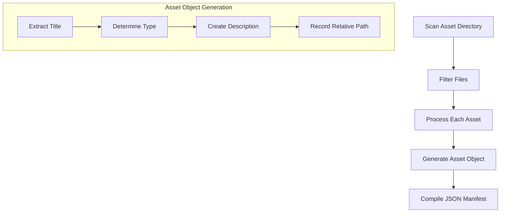
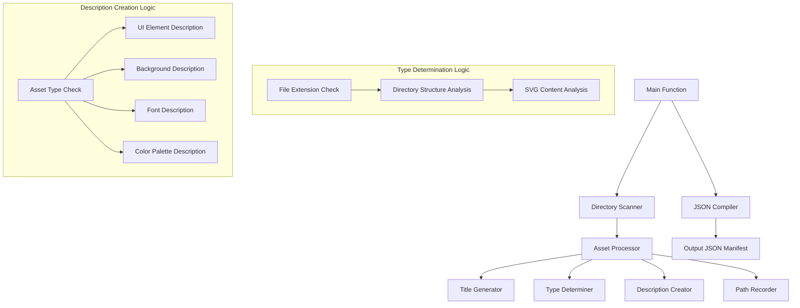

# Asset Manifest Generation Plan

## 1. Overview

We'll create a script that recursively scans the assets directory (`/Users/ranjith.babu/LearningLab/RooCode/framework/assets_library`), processes each asset file, and generates a JSON manifest with detailed information about each asset.

## 2. Asset Processing Workflow



## 3. Detailed Steps

### 3.1. Directory Scanning
- Recursively scan the assets directory (`/Users/ranjith.babu/LearningLab/RooCode/framework/assets_library`)
- Collect all files with their full paths
- Filter out `.DS_Store` files

### 3.2. Asset Processing
For each asset file:

#### 3.2.1. Title Generation
- Extract filename without extension
- Convert snake_case or kebab-case to Title Case
- For fonts: Use filename only (e.g., "Athletics-Black.otf" becomes "Athletics Black")

#### 3.2.2. Type Determination
- Based on file extension and directory structure:
  - `.svg` files:
    - Analyze SVG content to determine if it's an icon, button, background, etc.
    - Assign appropriate type: `svg_icon`, `svg_button`, `svg_background`, etc.
  - Font files (`.otf`, `.ttf`, `.woff`, `.woff2`): Assign type `font`
  - Image files (`.png`, `.jpg`, `.jpeg`): Assign type `image_background` if in backgrounds directory
  - `color_palette.json`: Assign type `color_palette`

#### 3.2.3. Description Creation
- For UI elements (buttons, inputs, icons): Describe their typical use based on filename and directory structure
- For backgrounds: Detail their visual style or intended placement
- For fonts: Format as "Font: [Font Name], Style: [Style/Weight]" extracted from filename
- For color palettes:
  - For `color_palette.json`: Extract color values and create a description stating "Application color scheme. Color4 is designated as the primary color; other colors serve as secondary or accent colors."
  - Include hex codes from the palette

#### 3.2.4. Relative Path Recording
- Store the path to the asset file, relative to the root of the scanned asset directory

### 3.3. JSON Manifest Compilation
- Compile all asset objects into a single JSON array
- Format the JSON with proper indentation for readability

## 4. Implementation Approach



## 5. Special Handling for Different Asset Types

### 5.1. SVG Content Analysis
- For SVGs, we'll analyze the content to determine if it's an icon, button, background, etc.
- This may involve checking SVG dimensions, complexity, and element structure

### 5.2. Color Palette Processing
- For `color_palette.json`, we'll extract the color values and create a comprehensive description
- We'll identify color4 as the primary color and list other colors as secondary or accent colors

### 5.3. Font Processing
- Extract font name and style from filename
- Format title as "[Font Name] [Style]" (e.g., "Athletics Black")
- Format description as "Font: [Font Name], Style: [Style]"

## 6. Example Output

The final JSON manifest will look something like this:

```json
[
  {
    "title": "Primary Button",
    "description": "A primary call-to-action button used for main actions in the interface.",
    "relativePath": "buttons/size_48_px/primary.svg",
    "type": "svg_button"
  },
  {
    "title": "Athletics Black",
    "description": "Font: Athletics, Style: Black",
    "relativePath": "fonts/Athletics/Athletics Black/Athletics-Black.otf",
    "type": "font"
  },
  {
    "title": "Color Palette",
    "description": "Application color scheme. Color4 is designated as the primary color; other colors serve as secondary or accent colors. Colors include: yellow4: #FFBA07, orange4: #FF7E3B, purple4: #ED0CEF, green4: #3DD771, blue4: #1EB5F0",
    "relativePath": "color_palette.json",
    "type": "color_palette"
  }
]
```

## 7. Challenges and Solutions

### 7.1. SVG Type Determination
**Challenge**: Accurately determining whether an SVG is an icon, button, or background.
**Solution**: Analyze SVG content, dimensions, and complexity. Use directory structure as a hint.

### 7.2. Descriptive Text Generation
**Challenge**: Creating meaningful descriptions for various asset types.
**Solution**: Use filename, directory structure, and file content to generate contextual descriptions.

### 7.3. Color Palette Extraction
**Challenge**: Extracting color values from `color_palette.json` and identifying the primary color.
**Solution**: Parse the JSON file and extract color4 values from each color category.

## 8. Implementation Steps

1. Create a script to recursively scan the assets directory
2. Implement file filtering to exclude `.DS_Store` files
3. Develop asset processing functions for each asset type
4. Implement title generation logic
5. Create type determination logic with SVG content analysis
6. Develop description creation functions for each asset type
7. Implement relative path recording
8. Create JSON compilation and output functions
9. Test the script with the existing asset directory
10. Generate the final JSON manifest